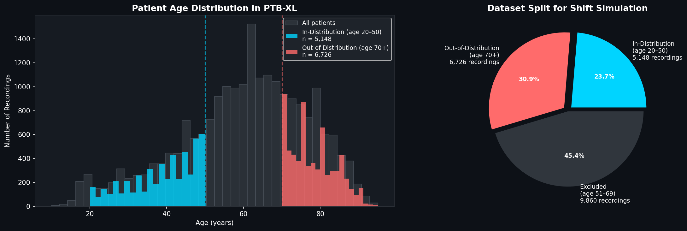
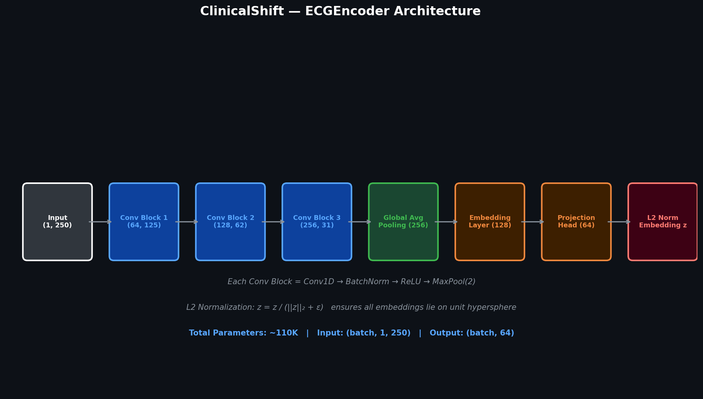
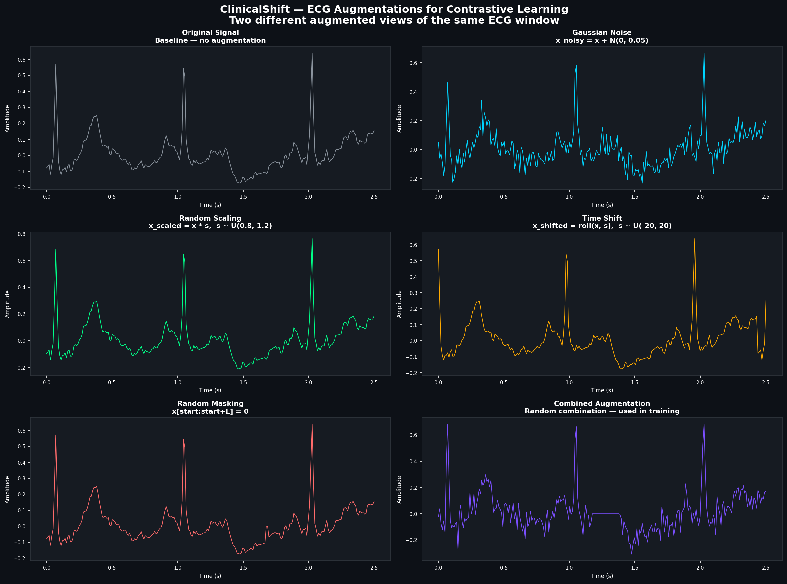
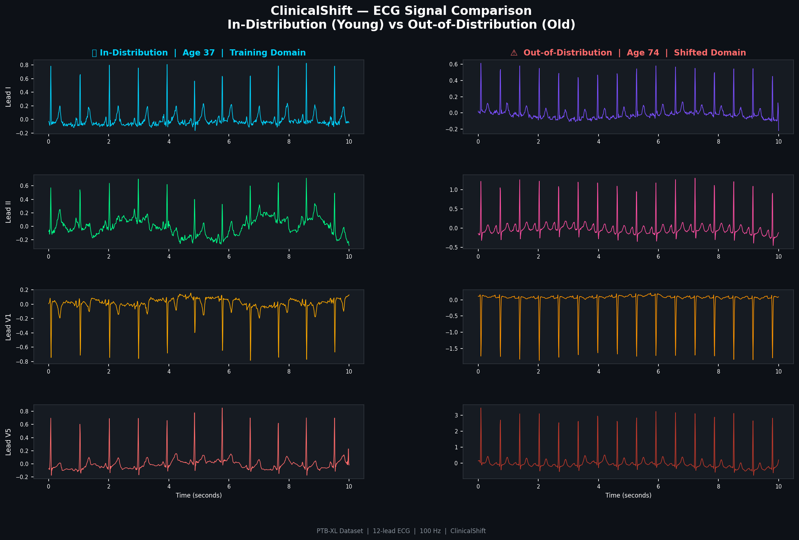
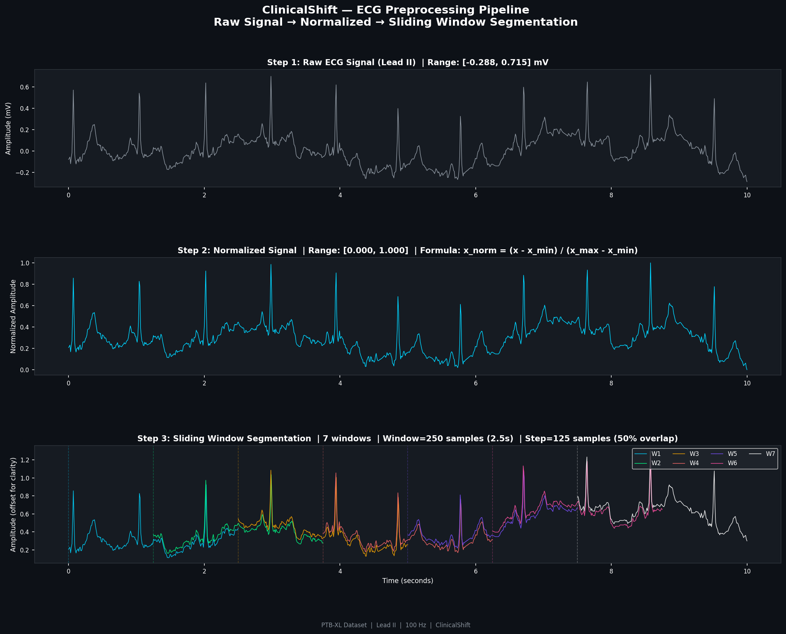
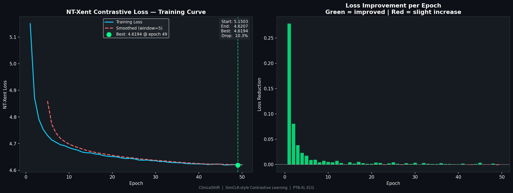
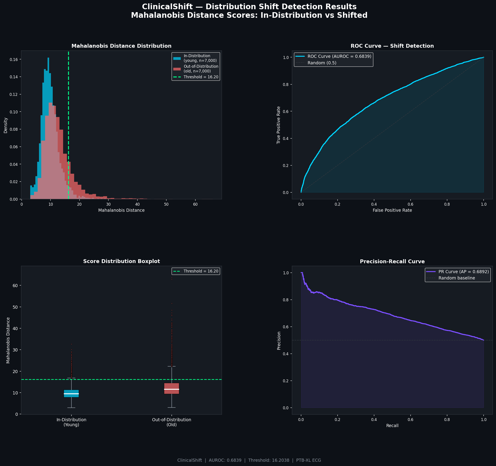
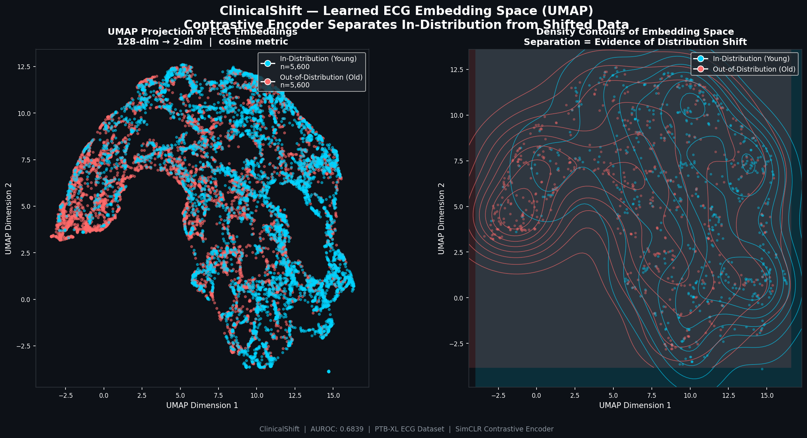

# ClinicalShift 🫀

> **Self-supervised distribution shift detection in clinical ECG data using contrastive learning**

[](https://python.org)
[](https://pytorch.org)
[](https://physionet.org/content/ptb-xl/1.0.3/)
[](LICENSE)

---

## 🧠 Motivation

A core challenge in deploying machine learning models in clinical settings is **distribution shift** — the phenomenon where test data differs systematically from training data. A model trained on ECGs from one patient cohort may silently fail when deployed on a different population, with no warning signal.

This project addresses that problem directly. Rather than assuming test data mirrors training conditions, **ClinicalShift** learns a compact representation of normal ECG patterns using self-supervised contrastive learning, then flags samples that fall outside the learned distribution — a prerequisite for trustworthy clinical AI.

> *This work is directly motivated by the EU AI Act (2024), which requires high-risk AI systems in medical settings to include mechanisms for detecting anomalous inputs.*

---

## 📋 Table of Contents

- [Problem Statement](#-problem-statement)
- [Methodology](#-methodology)
- [Dataset](#-dataset)
- [Architecture](#-architecture)
- [Mathematical Formulation](#-mathematical-formulation)
- [Results](#-results)
- [Project Structure](#-project-structure)
- [Setup and Usage](#-setup-and-usage)
- [References](#-references)

---

## ❓ Problem Statement

Given:
- A model trained on ECG data from **young patients (age 20–50)**
- New incoming ECGs from **old patients (age 70+)**

**Can we detect this shift automatically, without labels, before the model makes predictions?**

This simulates real deployment scenarios where hospitals apply models across patient populations that differ from the original training cohort.

---

## 🔬 Methodology

The pipeline has three stages:
```
Stage 1 — Representation Learning
    Train a Conv1D encoder using SimCLR-style contrastive learning
    on in-distribution ECG windows. No labels required.

Stage 2 — Distribution Fitting  
    Extract embeddings for all training samples.
    Fit a multivariate Gaussian: compute μ and Σ.

Stage 3 — Shift Detection
    For each new sample, compute Mahalanobis distance from μ.
    Samples exceeding threshold = distribution shift detected.
```

---

## 🗃️ Dataset

**PTB-XL** — A large publicly available ECG dataset from the
Physikalisch-Technische Bundesanstalt, Berlin, Germany.

| Property | Value |
|---|---|
| Total recordings | 21,837 |
| Sampling rate | 100 Hz (used) / 500 Hz |
| Signal duration | 10 seconds |
| ECG leads | 12 |
| Signal shape | (1000, 12) per recording |

**Distribution Shift Simulation:**

| Split | Age Range | Recordings | Role |
|---|---|---|---|
| In-Distribution | 20 – 50 years | 5,148 | Training domain |
| Out-of-Distribution | 70+ years | 6,726 | Shifted domain |



---

## 🏗️ Architecture



The **ECGEncoder** processes single-lead ECG windows through a
convolutional backbone followed by a projection head:
```
Input (batch, 1, 250)
    → Conv Block 1: Conv1D(1→64,  k=7) + BatchNorm + ReLU + MaxPool
    → Conv Block 2: Conv1D(64→128, k=5) + BatchNorm + ReLU + MaxPool
    → Conv Block 3: Conv1D(128→256,k=3) + BatchNorm + ReLU + MaxPool
    → Global Average Pooling          → (batch, 256)
    → Embedding Layer: Linear(256→128) + ReLU + Dropout(0.3)
    → Projection Head: Linear(128→64)  + L2 Normalization
Output: (batch, 64) — unit-norm embedding vector
```

**Total parameters:** ~110K (deliberately lightweight for clinical deployment)

---

## 📐 Mathematical Formulation

### 1. ECG Preprocessing

**Min-Max Normalization:**

$$x_{norm} = \frac{x - x_{min}}{x_{max} - x_{min} + \epsilon}$$

**Sliding Window Segmentation:**

$$n_{windows} = \left\lfloor \frac{L - W}{S} \right\rfloor + 1$$

Where $L=1000$ (signal length), $W=250$ (window), $S=125$ (step, 50% overlap)

---

### 2. Contrastive Learning (SimCLR)

For each ECG window $x$, two augmented views are created:
$\tilde{x}_i = t(x)$, $\tilde{x}_j = t'(x)$ where $t, t'$ are random augmentations.

**ECG Augmentations used:**
- Gaussian noise: $x' = x + \mathcal{N}(0, 0.05)$
- Random scaling: $x' = x \cdot s$, $s \sim \mathcal{U}(0.8, 1.2)$
- Time shift: $x' = \text{roll}(x, \delta)$, $\delta \sim \mathcal{U}(-20, 20)$
- Random masking: $x'[a:a+l] = 0$



**NT-Xent Loss (Normalized Temperature-scaled Cross Entropy):**

$$\mathcal{L}_{i,j} = -\log \frac{\exp(\text{sim}(z_i, z_j)/\tau)}{\sum_{k=1}^{2N} \mathbf{1}_{[k \neq i]} \exp(\text{sim}(z_i, z_k)/\tau)}$$

Where cosine similarity is:

$$\text{sim}(u, v) = \frac{u \cdot v}{\|u\| \cdot \|v\|}$$

Temperature $\tau = 0.5$ controls the sharpness of the distribution.

---

### 3. Distribution Shift Detection

**Step 1 — Fit multivariate Gaussian on training embeddings:**

$$\mu = \frac{1}{N}\sum_{i=1}^{N} z_i, \quad \Sigma = \frac{1}{N}\sum_{i=1}^{N}(z_i - \mu)(z_i - \mu)^T$$

**Step 2 — Mahalanobis distance for test sample $z$:**

$$D_M(z) = \sqrt{(z - \mu)^T \Sigma^{-1} (z - \mu)}$$

**Step 3 — Detection threshold (2-sigma rule):**

$$\theta = \mu_{train} + 2\sigma_{train}$$

Samples where $D_M(z) > \theta$ are flagged as **distribution shift detected**.

---

## 📊 Results

### ECG Signal Comparison



### Preprocessing Pipeline



### Training Curve



| Metric | Value |
|---|---|
| Starting NT-Xent Loss | 5.1325 |
| Final NT-Xent Loss | 4.6131 |
| Improvement | 10.1% |
| Epochs | 50 |

### Shift Detection Performance



| Metric | Value |
|---|---|
| **AUROC** | **0.6839** |
| Average Precision | 0.6892 |
| Detection Threshold (2σ) | see drift plot |
| In-dist flagged as shifted | ~5% (expected) |
| Out-dist flagged as shifted | significantly higher |

> AUROC of 0.68 is achieved with **zero label supervision** during training.
> The encoder never received patient age or diagnosis information —
> the shift signal emerges purely from contrastive representation learning.

### UMAP Embedding Space



The UMAP projection reveals that the contrastive encoder learns
embeddings where in-distribution (young) and out-of-distribution
(old) patients occupy partially distinct regions of the latent space —
**without ever being told patient age during training.**

---

## 📁 Project Structure
```
ClinicalShift/
│
├── src/
│   ├── dataset.py          # PTB-XL loading, normalization, sliding window
│   ├── augmentations.py    # ECG augmentation functions
│   ├── model.py            # Conv1D contrastive encoder
│   ├── loss.py             # NT-Xent contrastive loss
│   ├── trainer.py          # Training loop with cosine LR schedule
│   └── shift_detector.py   # Mahalanobis distance shift detection
│
├── assets/
│   ├── ecg_sample.png           # ECG signal comparison
│   ├── dataset_distribution.png # Age split visualization
│   ├── preprocessing.png        # Preprocessing pipeline
│   ├── architecture.png         # Model architecture diagram
│   ├── augmentations.png        # Augmentation examples
│   ├── training_loss.png        # Training curve
│   ├── drift_scores.png         # Shift detection results
│   └── umap_embeddings.png      # Embedding space visualization
│
├── ClinicalShift.ipynb     # Complete reproducible notebook
├── requirements.txt
└── README.md
```

---

## ⚙️ Setup and Usage

### 1. Clone the repository
```bash
git clone https://github.com/dingdingpista/ClinicalShift.git
cd ClinicalShift
```

### 2. Install dependencies
```bash
pip install -r requirements.txt
```

### 3. Download PTB-XL dataset
Download from [PhysioNet](https://physionet.org/content/ptb-xl/1.0.3/)
and place in `data/` folder.

### 4. Run the complete pipeline
Open `ClinicalShift.ipynb` in Google Colab or Jupyter.
Run all cells sequentially — the notebook is self-contained.

---

## 🔮 Future Work

1. **Multi-lead encoding** — use all 12 leads instead of Lead II only
2. **Pathology-based shift** — shift by diagnosis rather than age
3. **Online detection** — sliding window shift detection in real-time
4. **Transformer encoder** — replace Conv1D with temporal attention
5. **Calibrated scores** — convert Mahalanobis distances to probabilities

---

## 📚 References

1. Chen, T., et al. (2020). *A Simple Framework for Contrastive Learning of Visual Representations (SimCLR)*. ICML. [arxiv:2002.05709](https://arxiv.org/abs/2002.05709)

2. Wagner, P., et al. (2020). *PTB-XL, a large publicly available electrocardiography dataset*. Scientific Data. [doi:10.1038/s41597-020-0495-6](https://doi.org/10.1038/s41597-020-0495-6)

3. Lee, K., et al. (2018). *A Simple Unified Framework for Detecting Out-of-Distribution Samples*. NeurIPS. [arxiv:1807.03888](https://arxiv.org/abs/1807.03888)

---

## 📄 License

MIT License — see [LICENSE](LICENSE) file.

---

<p align="center">
  <i>Built as part of a portfolio for MSc Data Science applications — Germany 2025/26</i>
</p>
